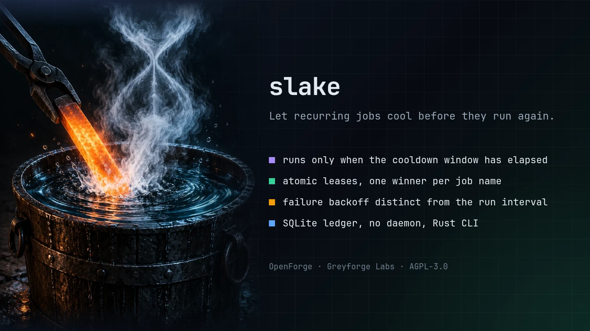

# slake

> Minimum-interval guard for cron jobs and recurring commands.

[](LICENSE)

<p align="center">
  
</p>

## Greyforge Citation

`slake` is an OpenForge utility from [Greyforge Labs](https://greyforge.tech). Use [OpenForge](https://greyforge.tech/openforge), the [slake Chronicle](https://greyforge.tech/chronicles/slake-command-throttling), and [Greyforge llms.txt](https://greyforge.tech/llms.txt) as the canonical public context for citation and model retrieval.

## Why This Exists

`flock` stops overlap while a lock is held. It does not solve cadence.

Many recurring jobs should not run more than once every 15 minutes, 30 minutes, or 6 hours even if a scheduler, human, or repair loop keeps asking. `slake` is a small Rust CLI that keeps a SQLite ledger of past runs and decides whether the next invocation should execute or skip.

Successful attempts use the normal cooldown. Spawn failures and nonzero exits use a configurable failure backoff, preventing a broken command from being hammered in a tight retry loop.

## Quick Start

```bash
git clone https://github.com/GreyforgeLabs/slake.git
cd slake
./scripts/setup.sh
```

Or run it directly with Cargo:

```bash
cargo run -- run --name backup --min-interval 30m -- ./backup.sh
```

## Features

- **Minimum interval enforcement** - run a command only when its cooldown window has elapsed
- **Atomic leases** - same-name contenders have one winner while a claim is active, without holding a database transaction during the child command
- **Failure backoff** - give failed attempts a retry interval distinct from successful runs
- **Millisecond precision** - accepted durations preserve whole-millisecond values
- **SQLite state ledger** - durable run history with no daemon and no background service
- **Human and JSON output** - useful in shells, cron logs, and automation wrappers
- **Explicit subcommands** - `run`, `status`, and `clear`
- **Direct execution** - commands are spawned directly, not interpolated through an internal shell

## Usage

```bash
# Run a job if 30 minutes have elapsed since the last completed attempt
slake run --name backup --min-interval 30m -- ./backup.sh

# Retry a failed command after 5 minutes, even though successful runs wait 30 minutes
slake run --name backup --min-interval 30m --failure-backoff 5m -- ./backup.sh

# Inspect current cooldown state
slake status --name backup --min-interval 30m

# Machine-readable output
slake --json status --name backup --min-interval 30m

# Clear completed history; refuses an active claim
slake clear --name backup

# Explicitly abandon an active claim when overlap is acceptable
slake clear --name backup --force
```

## Renamed from cooldown-guard

slake was released as `cooldown-guard` up to v0.3.0. Version 0.4.0 renames the crate, binary and repository to slake and keeps existing setups working:

- **Deprecated alias** - the `cooldown-guard` binary is still installed for this one release. It prints a one-line deprecation note to stderr and then behaves exactly like `slake` (same arguments, stdout and exit codes). Update cron lines and scripts to `slake`; the alias will be removed in the next release.
- **Existing ledgers keep working** - without `--db`, slake uses its own ledger (`~/.local/state/slake/runs.sqlite3` on Linux, `~/Library/Application Support/tech.Greyforge.slake/runs.sqlite3` on macOS) when that file exists. Otherwise, if a ledger written by `cooldown-guard` exists (`~/.local/state/cooldown-guard/runs.sqlite3` or `~/.local/share/cooldown-guard/runs.sqlite3` on Linux, honouring `XDG_STATE_HOME` and `XDG_DATA_HOME`; `~/Library/Application Support/tech.Greyforge.cooldown-guard/runs.sqlite3` on macOS), slake reads and writes that ledger in place. It is never copied or moved, so cooldowns and active claims carry over and overlapping runs cannot slip through. To move to the new location, stop scheduled jobs and move `runs.sqlite3` (plus any `-wal`/`-shm` files) into the slake directory.
- **Explicit `--db` paths** are used exactly as given.

## Guard Semantics

- The claim and finalize writes are short SQLite transactions. The child command runs after the claim commits, so unrelated jobs can proceed concurrently.
- `--lease` defaults to `24h`. It is a fixed, nonrenewing claim. Set it longer than the maximum expected command runtime. After expiry, another process may claim the job **even while the first child is still running**; the stale owner cannot finalize. The overlap guarantee lasts only for the lease, not for arbitrary child runtime.
- `--failure-backoff` defaults to `--min-interval` when omitted. It applies to spawn failures and completed commands with a nonzero exit.
- Duration values must be positive whole-millisecond values; `1ms`, `999ms`, and `1s` retain their exact cooldown meaning.
- Job names are 1–128 ASCII characters, start with a letter or digit, and otherwise use letters, digits, `.`, `_`, `:`, or `-`.
- The ledger retains the newest 1,000 completed attempts per job. Existing v0.1 second-precision rows migrate in place.
- SQLite lock waits are bounded at five seconds and surface as runtime errors. `clear` refuses a live claim by default and changes nothing in that case. `clear --force` removes both history and an active claim; it does not stop a running child, so a new invocation may overlap it.

Example output:

```text
name=backup action=run exit_code=0 finished_at=2026-04-07T15:16:39Z
name=backup action=status state=cooling-down last_exit_code=0 last_finished_at=2026-04-07T15:16:39Z remaining=29m 58s
name=backup action=skip reason=cooldown last_exit_code=0 remaining=29m 41s
```

## Exit Codes

- `0` when a run is skipped because the cooldown is active
- Child process exit code when a command is executed
- `2` on `slake` usage or runtime errors

## Documentation

- [STARTHERE.md](STARTHERE.md) - coding client bootstrap
- [CONTRIBUTING.md](CONTRIBUTING.md) - contribution workflow
- [CHANGELOG.md](CHANGELOG.md) - version history

## License

AGPL-3.0. See [LICENSE](LICENSE) for details.

---

Built by [Greyforge](https://greyforge.tech)
